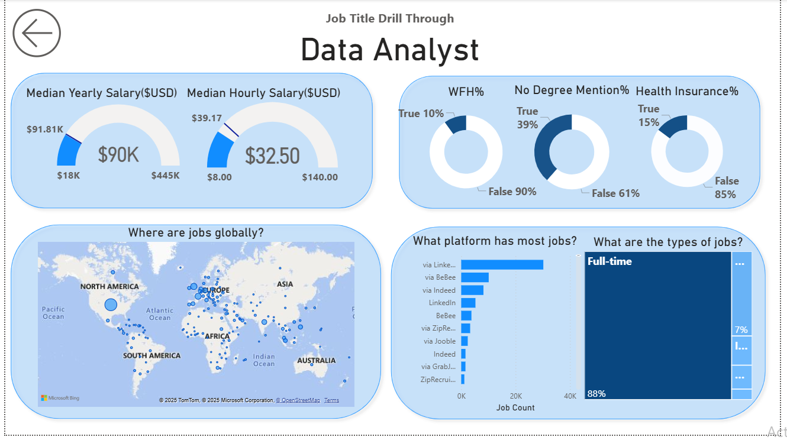

# PowerBI-data-jobs-dashboard
# 📊 Data Jobs Dashboard with Power BI

---

## 📝 Introduction  
This dashboard was created for **Job Seekers, Job Transitioners, and Career Switchers** to provide insights into the data job market.  
Information about data-related jobs is often scattered and difficult to interpret. Using a *real-world dataset of 2024 data jobs* (including job titles, salaries, and locations), this project offers a simple, interactive, and visually clear dashboard to explore:  

- Market trends  
- Salary benchmarks  
- Job demand across roles and geographies  
- Key hiring platforms  

---

## 🚀 Skills Showcased  

- **Data Transformation (ETL) with Power Query:**  
  Cleaned and shaped raw data, handled blanks, changed data types, and created calculated columns.  

- **DAX Measures & KPIs:**  
  Built measures such as *Median Yearly Salary*, *Median Hourly Salary*, and *Job Counts* to derive insights.  

- **Visualization & Charts:**  
  Used **Line, Bar, Column, Treemap, Donut, and Map visuals** to represent different aspects of job data.  

- **Drill-through Functionality:**  
  Enabled job title drill-through pages for deeper analysis (e.g., Data Analyst, Data Engineer, etc.).  

---

## 📌 Dashboard Overview  

### Page 1: High-Level Market View  

  

This is the mission control of the **Data Jobs Dashboard**.  
It highlights key KPIs such as:  
- Total job count (479K+)  
- Median salaries  
- Top job titles by demand  
- Salary vs hourly trends  

At a glance, users can understand what’s happening in the **2024 data job market**.  

---

### Page 2: Job Title Drill-Through (Example: Data Analyst)  

  

This page allows users to drill through into a specific job title.  
For example, **Data Analyst** insights include:  
- Median yearly salary: **$90K**  
- Median hourly salary: **$32.50**  
- % of jobs with *remote work options*  
- % of jobs without a *degree requirement*  
- Global distribution of jobs on a map  
- Platforms with the most job postings  

---

## 📂 Files in Repository  

- `Data_Jobs_Dashboard.pbix` → Power BI project file  
- `images/image1.png` → High-Level Dashboard Screenshot  
- `images/image2.png` → Drill-Through Dashboard Screenshot  

---

## 💡 Key Learnings  

- Gained practical experience with **Power BI report building**  
- Learned how to clean and transform datasets using **Power Query**  
- Developed skills in **DAX for calculations & KPIs**  
- Built a **multi-page interactive dashboard** with drill-through analysis  

---

## 📬 Contact  

👩‍💻 Created by *Khushi Soni*  
If you liked this project, feel free to ⭐ the repo!  
